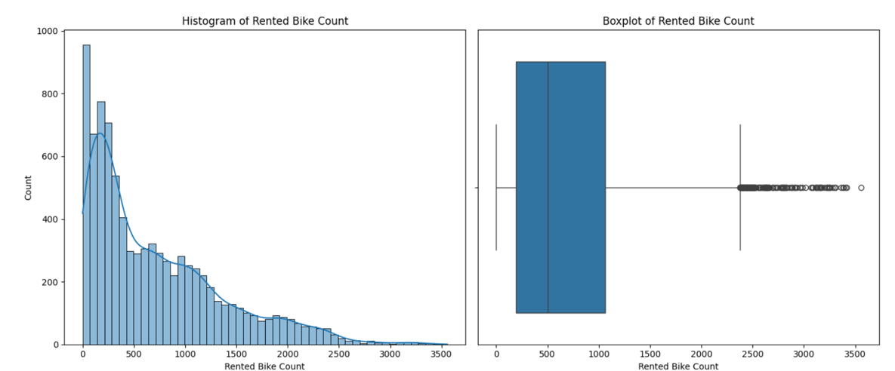
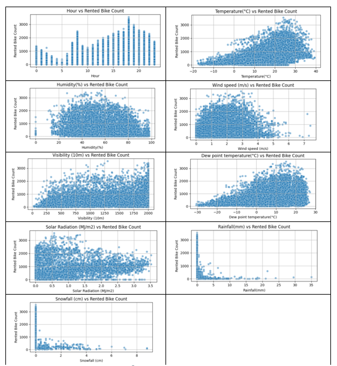
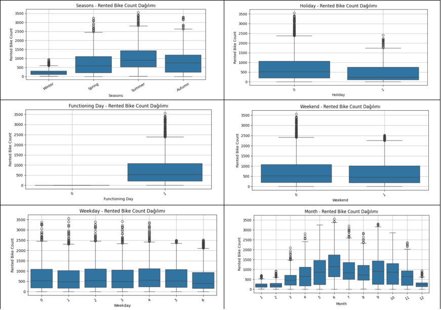
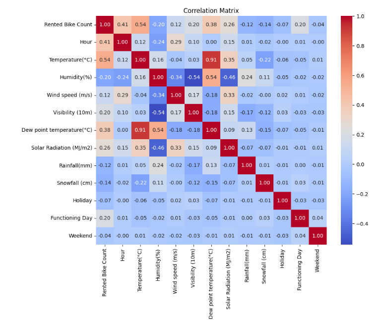
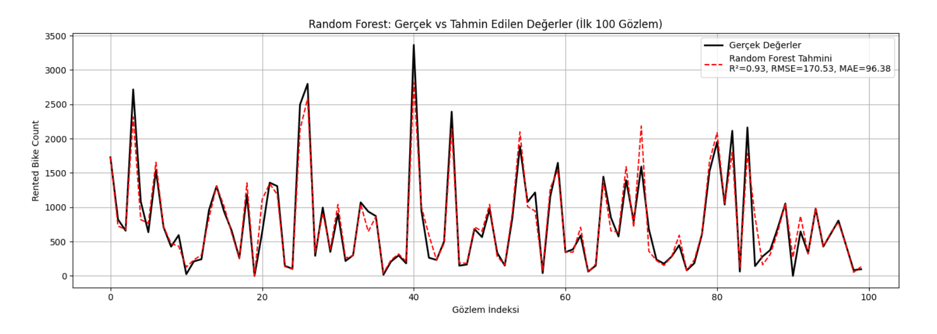
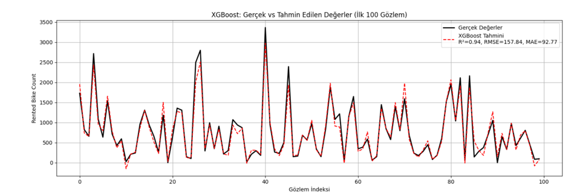
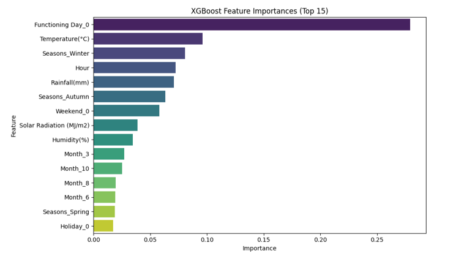

Bisiklet Paylaşım Sistemlerinde Talep Öngörüsü: Veri Madenciliği Tabanlı Bir Çalışma
# 🚲 Seoul Bike Sharing Demand Prediction

Bu proje, **Güney Kore'nin Seul şehrindeki kamuya açık bisiklet paylaşım sistemi** için saatlik bisiklet talebini tahmin etmeyi amaçlamaktadır. Makine öğrenmesi tabanlı bu çalışmada, hava durumu ve tarihsel veriler kullanılarak regresyon modelleri geliştirilmiştir.

---

## 🎥 Tanıtım Videosu

📺 [Projeyi YouTube'da İzle](https://youtu.be/mAlOJ9mv2UQ)

---

## 📁 Veri Seti Bilgisi

- **Kaynak:** Seoul City Government
- **Zaman Aralığı:** 01/12/2017 – 30/11/2018 (Saatlik veri)
- **Gözlem Sayısı:** 8.760
- **Hedef Değişken:** `Rented Bike Count`

### Özellikler:
- Saatlik hava durumu: sıcaklık, nem, rüzgar, güneşlenme, yağış, kar vb.
- Tarih bilgisi: Ay, Gün, Hafta içi/sonu
- Tatil ve çalışılabilir gün bilgisi
- Mevsim bilgisi

---

## 🛠️ Kullanılan Teknolojiler ve Kütüphaneler

- Python 3
- pandas, numpy
- seaborn, matplotlib
- scikit-learn
- xgboost

---

## 🔄 Veri Ön İşleme

- `Date` sütunu `datetime` formatına çevrildi ve `Month`, `Day`, `Weekday`, `Weekend` gibi değişkenler türetildi.
- Kategorik veriler `OneHotEncoder` ile işlenmiştir.
- Eksik veri bulunmamaktadır.

---

## 📊 Keşifsel Veri Analizi (EDA)

- Hedef değişkenin dağılımı, aykırı değerler ve çarpıklık analiz edildi.

- Sayısal değişkenlerle olan ilişkiler scatterplot ile görselleştirildi.

- Kategorik değişkenler için boxplot kullanıldı.
  
- Korelasyon matrisi oluşturularak en etkili değişkenler belirlendi.

---

## 🧠 Modelleme

İki farklı regresyon modeli test edilmiştir:

- `RandomForestRegressor`
- `XGBRegressor`

### Pipeline:
- **Ön işleme:** `ColumnTransformer` ile kategorik veriler `OneHotEncoder` kullanılarak dönüştürülmüştür.
- **Model:** Sklearn pipeline yapısı kullanılmıştır.

### Hiperparametre Optimizasyonu:
- `GridSearchCV` (3-fold CV) ile en iyi hiperparametreler belirlenmiştir.

---

## 📈 Performans Sonuçları

| Model         | R² Skoru | RMSE   | MAE    |
|---------------|----------|--------|--------|
| Random Forest | 0.9302   | 170.53 | 96.38  |
| XGBoost       | 0.9402   | 157.84 | 92.77  |

> **Not:** XGBoost modeli, daha yüksek doğruluk ve düşük hata oranları ile en iyi performansı göstermiştir.

---

## 📌 Özellik Önem Grafiği (XGBoost)

En önemli değişkenler:
1. Hour
2. Temperature
3. Functioning Day
4. Month
5. Humidity

---

## 🔁 10-Fold Cross Validation Sonuçları

| Model         | R² (± std)      | RMSE (± std)   | MAE (± std)    |
|---------------|------------------|----------------|----------------|
| Random Forest | 0.9322 ± 0.0098 | 167.13 ± 11.34 | 97.25 ± 3.79   |
| XGBoost       | 0.9436 ± 0.0092 | 152.33 ± 12.29 | 93.80 ± 5.53   |

---

## 🔬 Literatür Karşılaştırması

Bu çalışmada geliştirilen XGBoost modeli, 2020 yılında aynı veri seti ile yapılan araştırmadan daha başarılı sonuçlar vermiştir:

| Model             | R² Skoru | RMSE   | MAE    |
|-------------------|----------|--------|--------|
| **Bu Çalışma**    | 0.9402   | 157.84 | 92.77  |
| XGBoost (2020)    | 0.91     | 183.80 | 119.59 |

---

